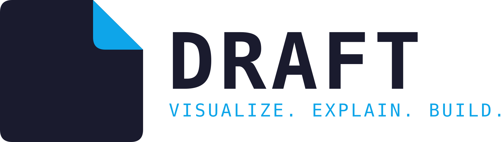

<p align="center">
  
</p>

<p align="center"><strong>If you can't explain it to AI, show it to AI.</strong></p>

DRAFT is a cross-platform visual workspace where you sketch, draw, annotate, and organize
ideas — and an MCP-compatible AI agent reads that workspace directly instead of you
re-explaining it in text or re-uploading screenshots. It's built especially for game and
level design, but works for any visual planning: software architecture, UI mockups,
storyboards, diagrams.

DRAFT is **not** a drawing app, an AI image generator, a whiteboard clone, or an
Anthropic/Claude-specific plugin. It's the visual context layer that sits between a human's
intent and an AI agent's understanding of it. See [docs/product.md](docs/product.md) for the
full picture.

## Status

DRAFT is in active foundation development (pre-v1) — real, but not yet feature-complete.
The desktop app (`apps/desktop`, Tauri + React) already has a working infinite canvas: draw
and resize rectangles, ellipses, diamonds, lines, arrows, freehand strokes, and text; fill
colors; group/ungroup; undo/redo; import images/SVGs/video (reference-only); pan/zoom; save
and reopen a project. Illustrator-style tool shortcuts and grouped tool flyouts, a custom
frameless titlebar, and a Figma-style floating toolbar round out the chrome. Two real MCP
transports exist in `crates/draft-mcp` (stdio for any standard MCP client, plus a live
local-socket channel for the running desktop app), gated by a visible, revocable "Agent
access" permission control — see [docs/mcp.md](docs/mcp.md) for exactly what each transport
can do today.

**Not ready yet:** `apps/web` is still a placeholder shell — the browser build doesn't talk
to a live desktop session ([ADR-016](docs/decisions/adr-016-web-desktop-bridge.md) has the
plan). Keyboard-only canvas use isn't supported (drawing/selecting/moving a shape currently
needs a pointer). See [ROADMAP.md](ROADMAP.md) for the full, honestly-tracked checklist of
what's done versus planned — nothing here should be assumed finished just because it's
mentioned above.

## Repository layout

```
apps/
  desktop/     Tauri 2 + React desktop shell
  web/         Vite + React web shell (minimal — see ROADMAP.md)
crates/
  draft-core/      shared IDs, error types
  draft-project/   project format (read/write/migrate)
  draft-graph/     the Project Graph (applies operations to build state)
  draft-events/    the operation/event log
  draft-media/     asset metadata + content hashing
  draft-mcp/       MCP server (stdio + live local-socket transports, permission-gated)
  draft-security/  permission model + path-safety helpers
  draft-platform/  OS abstraction trait
packages/
  ui/              shared React components + design tokens
  canvas/          the custom canvas engine
  project-client/  typed wrapper around Tauri IPC calls
  shared/          TS types shared between frontend and the Rust core's JSON boundary
docs/              architecture, product, and process documentation
docs/decisions/    Architecture Decision Records (ADRs)
```

For *why* it's shaped this way, start with [ARCHITECTURE.md](ARCHITECTURE.md).

## Getting started

Prerequisites: Rust (stable, via [rustup](https://rustup.rs)), Node 22.13+, and
[pnpm](https://pnpm.io).

```bash
pnpm install
pnpm build
cargo build --workspace
```

Run the desktop app in development:

```bash
pnpm dev
```

Run tests:

```bash
pnpm test              # TypeScript packages (Vitest)
cargo test --workspace # Rust crates
```

Lint/format:

```bash
pnpm lint
cargo clippy --workspace --all-targets
cargo fmt --all
```

## Documentation

- [ARCHITECTURE.md](ARCHITECTURE.md) — high-level system design
- [docs/product.md](docs/product.md) — what DRAFT is and isn't, and who it's for
- [docs/project-format.md](docs/project-format.md) — the `.draft` project bundle format
- [docs/project-graph.md](docs/project-graph.md) — the Project Graph model
- [docs/mcp.md](docs/mcp.md) — the MCP server design
- [docs/agent-permissions.md](docs/agent-permissions.md) — the agent permission model
- [docs/decisions/](docs/decisions/) — ADRs for the significant technical decisions
- [ROADMAP.md](ROADMAP.md) — what's built, what's next
- [SESSION_LOG.md](SESSION_LOG.md) — dated narrative of each work session: decisions, bugs
  found and fixed, what got verified and how
- [CONTRIBUTING.md](CONTRIBUTING.md) — development workflow
- [SECURITY.md](SECURITY.md) — reporting a vulnerability

## License

DRAFT is **free forever** but **not open source** — the source is available in this
repository for transparency, but it's proprietary. See [LICENSE.md](LICENSE.md) for the
exact terms.

Created by **P4inz** (Atharva Patil).
